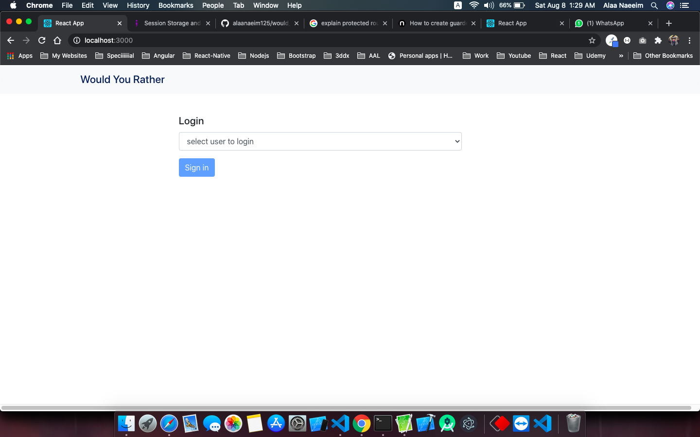
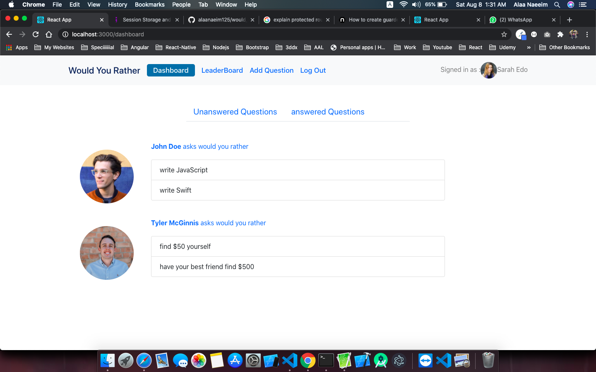
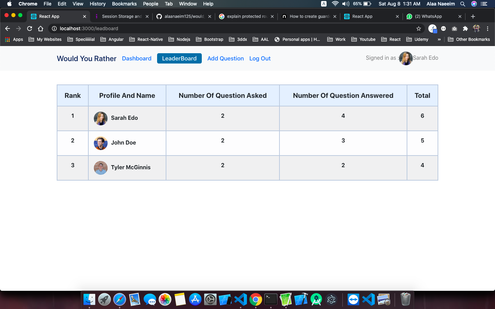
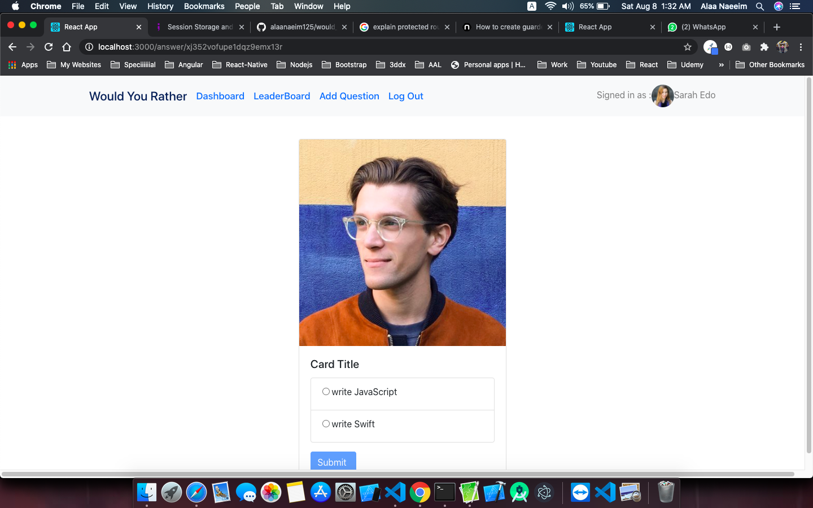
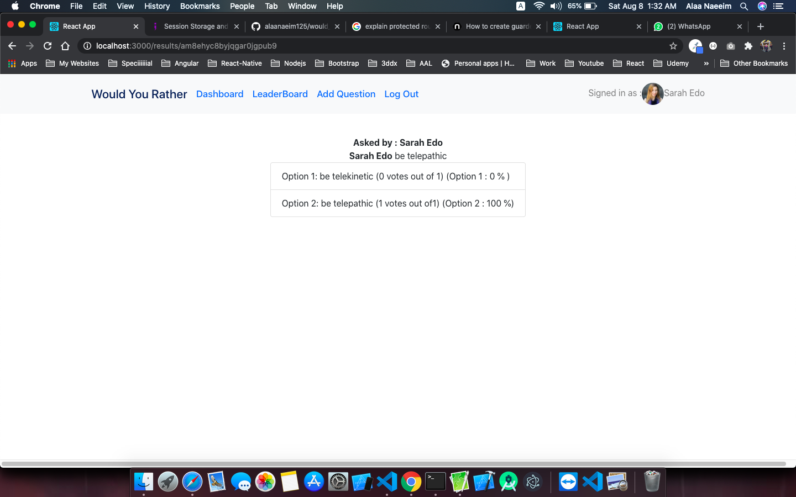

# Would You Rather Project

This is a project form Udacity's React Nanodegree called Would you rather. The project is to help the developer practice using the Redux Store, React Router Dom and when to use the store and the component's state,

## Installation

- clone repo `https://github.com/alaanaeeim/Would_You_Rather`
- install project with `npm install`
- run with `npm start`

screenShot

## Screenshots

 

   
   
   
   
   

